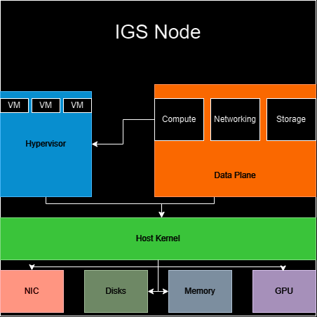

# System Architecture

This document provides an overview of the system architecture and its key components.

## System Overview

IGS consists of a monolithic architecture using a client/server pattern to implement VM and storage management subsystems.

The system architecture looks like the following diagram, currently:

As we can see, IGS runs as a regular process on top of Linux.

The compute subsystem uses QEMU to implement most of the VM functionality that we need and will be used to bring the features in the next versions of IGS to life.

The networking subsystem also uses QEMU's networking stack in order to allow VMs to connect to the external network.

The storage subsystem relies heavily on Linux for managing physical disks and partitions.

The systems that IGS relies on are quite mature, which makes it possible for the hyperscaler to exist with a ton of features that immediately compete with the other hyperscalers. No single person could write all of the technologies that IGS uses in reasonable amount of time, so definitely give a star to those projects.

Currently, IGS is a monolith, making it not a production-ready hyperscaler, but the monolith has served a purpose of getting it built quickly.
Version 1 will switch it to an SOA with a proper control and data plane.

## Key Components

### Server
The server handles all of the host management subsystems:
- Managing VMs
- Managing Storage

### VM Subsystem
The VM subsystem manages virtual machine features:
- Creation
- Deletion
- Start
- Shutdown
- Connect over SSH

### Storage Layer
The storage subsystem manages storage features:
- Move disks into IGS
- Partition disks
- Create partitions
- Delete partitions
- Attach partition to VM
- Detach partition from VM

### Client
The client acts as a pure messaging connection for telling the server or what will soon be the dataplane what to do.

## Security Architecture
Security is a critical part of any hyperscaler. IGS supports the current security features that are critical for its MVP:
- Automatically handling SSH connections to VMs

## Deployment Architecture
The system is pre-production and can be deployed in various configurations:
- Single cluster
- Multi-region
- Hybrid cloud

## Additional Resources
- [Installation Guide][install-guide]
- [Launch Guide][launch-guide]
- [GitHub Issues][issues]

[install-guide]: ../installation.md
[launch-guide]: ../launch.md
[issues]: https://github.com/InfraMatrix/IGS-dataplane/issues
